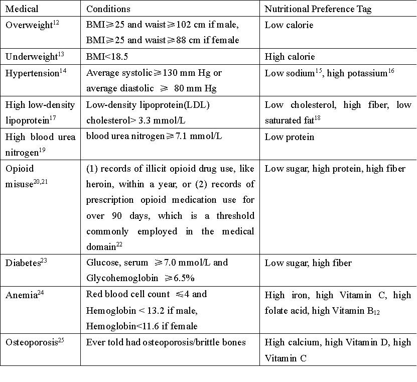
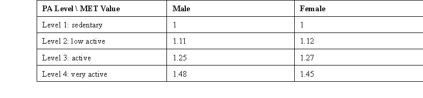
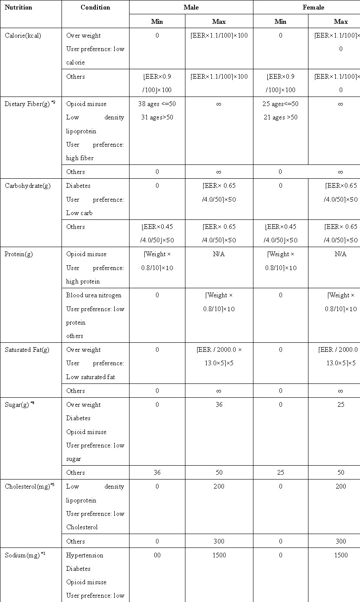
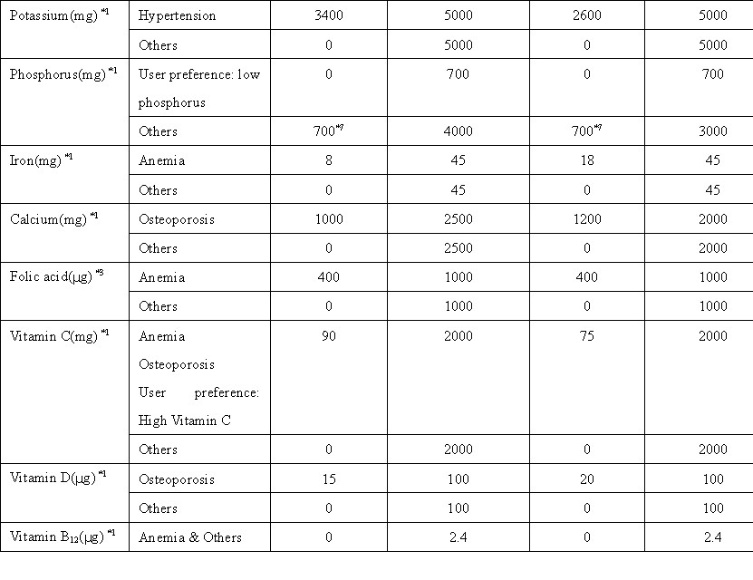
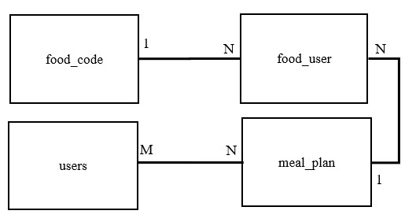

# Dataset Usage Guidance

This dataset aims to give a daily meal plan for person with physical and medical conditions.
DMP4P contains 215,135 daily meal plans with 16 key nutrients and 23,152 adult individuals with 9 health conditions from NHANES.
The daily meal plan meets specific individuals' nutrition requirement. Nutrition requirement calculation is as below criteria.

## Medical conditions calculation logic

Table 1. Medical conditions are calculated based on literatures. Nutrititional Preference Tag link nutrition with medical conditions.



## Nutrition Requirement Calculation
- Estimated Energy Requirement(EER) was calculated using the equations from the National Academy of Medicine:
```
EER_male   = 662 − 9.53×age + MET×(15.91×weight + 539.6×height)
EER_female = 354 − 6.91×age + MET×(9.36×weight + 726×height)
```
where PA represents the physical activity coefficient derived from the MET value, weight is in kilograms, and height is in meters. The Metabolic Equivalent of Task (MET) values were assigned based on each individual's reported physical activity level using the standardized classification system29: 
Gender-specific MET values were applied based on established energy expenditure differences:

- Daily Carbohydrate intake requirement calculation: EER* (0.45~0.65) /4.0
- Daily Saturated Fat intake requirement calculation: EER / 2000.0 * 13.0
- Daily Protein intake requirement calculation = weight * 0.8 while the Recommended Dietary Allowance (RDA) for protein is a modest 0.8 grams of protein per kilogram of body weight.

## Condition-specific nutrition range determinations
Each user's nutritional requirements were represented as a range [min, max] for multiple nutrients.



# Dataset Introduction

DMP4P contains six CSV file and one SQL file.

1. food_code.csv: food item information

| column         | type    | description                                                                            |
|----------------|---------|----------------------------------------------------------------------------------------|
| food_id        | numeric | food code, refer to What's In The Foods You Eat Search Tool 2021-2023.xlsx for details |
| food_desc      | text    | English description                                                                    |
| food_desc_long | text    | English description too, but be translated to ohter language  if necessary             |
| years          | numeric | the year of data generated, eg. 0304 represent the data created in 2003-2004.          |
| positive       | numeric | 1 represents healthy food based on DASH Eating Plan                                    |
| negative       | numeric | 1 represents unhealthy food based on DASH Eating Plan                                  |

2. food_user.csv and food_user_bronze.csv: link food with user. 
food_user.csv and food_user_bronze.csv have same columns but generated by different methods.
- food_user.csv: the users consumed food within personal nutritional requirement ranges existing NHANES dataset.
- food_user_bronze.csv:  contains the data does not exist in the NHANES dataset. We generated them by the algorithm.

| column         | type    | description                                                                                               |
|----------------|---------|-----------------------------------------------------------------------------------------------------------|
| food_id | numeric | food code, same as food_id in food_code.csv                                                               |
| user_id | numeric | user id from NHANES demographic dataset                                                                   |
| eating_type | numeric | 1 Breakfast, 2 Lunch, 3 Dinner,4 Supper,5 Brunch,6 Snack,7 Drink,8 Infant feeding, 9 Extended consumption |
| grams | numeric | the grams ever consumed by the user                                                                       | 
| day | numeric | 1.0 for the first day, 2.0 for the second day， etc                                                        | 
| years | numeric | the year of data generated, 2025 represents generating by algorithm |
| daily_food_id | numeric | meal plan id, concat(user_id, years, and day) |

3. daily_food_with_nutrition_target_gold.csv, daily_food_with_nutrition_target_silver.csv, daily_food_with_nutrition_target_bronze.csv: link meal plan with personal nutrition requirement range.

Three files are generated by different methods. The mandatory columns of three files are the same.
- daily_food_with_nutrition_target_gold.csv contains 148 daily meal plans. We filtered the existed NHANES dietary data meeting consumer‘s personal nutritional target range.
- daily_food_with_nutrition_target_silver.csv contains 151 daily meal plans. Exclude users in gold csv file. We calculated left users' personal nutritional target range, and find existed meal plan consumed by others.
- daily_food_with_nutrition_target_bronze.csv contains 214836 daily meal plans. Exclude users in gold and silver csv file. We use generic algorithm to generate daily meal plans which meet the nutritional requirement range.

| column | type    | description                                                                                         |
|--------|---------|-----------------------------------------------------------------------------------------------------|
| user_id | numeric | User Info. user id same as food_user.csv                                                            |
| age_group | numeric | User Info. Age range (e.g. 19-20, 21-30 …)                                                          |
| gender | numeric | User Info. 1.0 for male, 2.0 for female                                                             |
| age | numeric | User Info. User age in years                                                                        |
| weight | float   | User Info. Body weight (kg)                                                                         |
| height | float   | User Info. Body height (m)                                                                          |
| target | string  | User Info. Nutrition requirement range, convert from dict to string                                 |
| level | numeric | User Info. PA level                                                                                 |
| blood_pressure | bool    | User Info. Indicator for high blood pressure                                                        |
| low_density_lipoprotein | bool    | User Info. Indicator for elevated LDL                                                               |
| blood_urea_nitrogen | bool    | User Info. Indicator for abnormal BUN                                                               |
| opioid_misuse | bool    | User Info. Indicator for opioid misuse                                                              |
| diabetes | bool    | User Info. Indicator for diabetes                                                                   |
| anemia | bool    | User Info.Indicator for anaemia                                                                     |
| osteoporosis | bool    | User Info.Indicator for osteoporosis                                                                |
| under_weight | bool    | User Info.Indicator for under-weight status                                                         |
| over_weight | bool    | User Info.Indicator for over-weight status                                                          |
| user_low_phosphorus | bool    | User Info.Flag: user prefers a low-phosphorus diet                                                  |
| user_low_carb | bool    | User Info.Flag: user prefers a low-carb diet                                                        |
| user_low_calorie | bool    | User Info.Flag: user prefers a low-calorie diet                                                     |
| user_high_calorie | bool    | User Info.Flag: user prefers a high-calorie diet                                                    |
| user_low_sodium | bool    | User Info.Flag: user prefers a low-sodium diet                                                      |
| user_high_potassium | bool    | User Info.Flag: user prefers a high-potassium diet                                                  |
| user_low_saturated_fat | bool    | User Info.Flag: user prefers a low-saturated-fat diet                                               |
| user_low_cholesterol | bool    | User Info.Flag: user prefers a low-cholesterol diet                                                 |
| user_low_protein | bool    | User Info.Flag: user prefers a low-protein diet                                                     |
| user_high_protein | bool    | User Info.Flag: user prefers a high-protein diet                                                    |
| user_low_sugar | bool    | User Info.Flag: user prefers a low-sugar diet                                                       |
| user_high_fiber | bool    | User Info.Flag: user prefers a high-fibre diet                                                      |
| user_high_vitamin_b12 | bool    | User Info.Flag: user prefers a high-vitamin-B12 diet                                                |
| user_high_folate_acid | bool    | User Info.Flag: user prefers a high-folate diet                                                     |
| user_high_iron | bool    | User Info.Flag: user prefers a high-iron diet                                                       |
| user_high_vitamin_c | bool    | User Info.Flag: user prefers a high-vitamin-C diet                                                  |
| user_high_calcium | bool    | User Info.Flag: user prefers a high-calcium diet                                                    |
| user_high_vitamin_d | bool    | User Info.Flag: user prefers a high-vitamin-D diet                                                  |
| daily_food_id | string  | Meal Plan Info. meal plan id, concat(user_id, years, and day)                                       |
| grams | numeric | Meal Plan Info. The weight of food (g) of that day                                                  |
| calorie | numeric | Meal Plan Info. Total energy intake that day (kcal)                                                 |
| protein | numeric | Meal Plan Info. Protein intake (g)                                                                  |
| carb | numeric | Meal Plan Info. Carbohydrate intake (g)                                                             |
| sugar | numeric | Meal Plan Info. Sugar intake (g)                                                                    |
| fiber | numeric | Meal Plan Info. Dietary fibre intake (g)                                                            |
| saturated_fat | numeric | Meal Plan Info. Saturated fat intake (g)                                                            |
| cholesterol | numeric | Meal Plan Info. Cholesterol intake (mg)                                                             |
| folic_acid | numeric | Meal Plan Info. Folate intake (μg DFE)                                                              |
| vitamin_b12 | numeric | Meal Plan Info. Vitamin B12 intake (μg)                                                             |
| vitamin_c | numeric | Meal Plan Info. Vitamin C intake (mg)                                                               |
| vitamin_d | numeric | Meal Plan Info. Vitamin D intake (μg)                                                               |
| calcium | numeric | Meal Plan Info. Calcium intake (mg)                                                                 |
| phosphorus | numeric | Meal Plan Info. Phosphorus intake (mg)                                                              |
| potassium | numeric | Meal Plan Info. Potassium intake (mg)                                                               |
| iron | numeric | Meal Plan Info. Iron intake (mg)                                                                    |
| sodium | numeric | Meal Plan Info. Sodium intake (mg)                                                                  |
| b_calorie | bool    | Flag only in gold and silver: 1 for meeting calorie requirement                                     |
| b_carb | bool    | Flag only in gold and silver: 1 for meeting  carb requirement                                       |
| b_fiber | bool    | Flag only in gold and silver: 1 for meeting  fibre requirement                                      |
| b_protein | bool    | Flag only in gold and silver: 1 for meeting  protein requirement                                    |
| b_saturated_fat | bool    | Flag only in gold and silver: 1 for meeting  saturated-fat requirement                              |
| b_sugar | bool    | Flag only in gold and silver: 1 for meeting  sugar requirement                                      |
| b_cholesterol | bool    | Flag only in gold and silver: 1 for meeting  cholesterol requirement                                |
| b_sodium | bool    | Flag only in gold and silver: 1 for meeting  sodium requirement                                     |
| b_phosphorus | bool    | Flag only in gold and silver: 1 for meeting  phosphorus requirement                                 |
| b_potassium | bool    | Flag only in gold and silver: 1 for meeting  potassium requirement                                  |
| b_iron | bool    | Flag only in gold and silver: 1 for meeting  iron requirement                                       |
| b_calcium | bool    | Flag only in gold and silver: 1 for meeting  calcium requirement                                    |
| b_folic_acid | bool    | Flag only in gold and silver: 1 for meeting  folate requirement                                     |
| b_vitamin_c | bool    | Flag only in gold and silver: 1 for meeting  vitamin-C requirement                                  |
| b_vitamin_d | bool    | Flag only in gold and silver: 1 for meeting  vitamin-D requirement                                  |
| b_vitamin_b12 | bool    | Flag only in gold and silver: 1 for meeting  vitamin-B12 requirement                                |
| macro_health_score | float   | Macronutrient health score only in gold and silver: sum Macro nutritient Flags                      |
| micro_health_score | float   | Micronutrient health score only in gold and silver: sum Micro nutritient Flags                      |
| total_positive_score | float   | only in gold and silver: Sum of positive flags of food items in food_user file                      |
| total_negative_score | float   | only in gold and silver: Sum of negative of food items in food_user file                            |
| match | bool    | Flag: daily meal plan meets nutrition requirement range, TRUE for gold and silver. FALSE for bronze |

4. backup.sql file for Web-based Daily Meal Plan Recommendation system.

backup.sql file is generated as PostgreSQL standard based on above csv files. refer to [INSTALL guidance](INSTALL.md) for database creation.
There are 5 master and 3 temporary tables. 

| Table Name                              | Description                                                                                       | Table Type |
|-----------------------------------------|---------------------------------------------------------------------------------------------------|------------| 
| meal_plan                               | daily meal plan table, generated by 3 temporary tables                                            | Master     |
| food_user                               | link food item with daily meal plan, generated by food_user.csv and food_user_bronze.csv          | Master     |
| users                                   | user info, generated by 3 temporary tables                                                        | Master     |
| food_code                               | food item description table, generated by food_code.csv                                           | Master     |
| daily_food_with_nutrition_target_gold   | import from daily_food_with_nutrition_target_gold.csv                                             | Temporary  |
| daily_food_with_nutrition_target_silver | import from daily_food_with_nutrition_target_silver.csv                                           | Temporary  |
| daily_food_with_nutrition_target_bronze | import from daily_food_with_nutrition_target_bronze.csv                                           | Temporary  |

The relationship between tables as below ERD graph:



One user have many meal_plans, one meal plan serves many users, <br>
if you want to find meal plan for one user, you need calculate nutrition range and than use sql condition to find meal plan.

