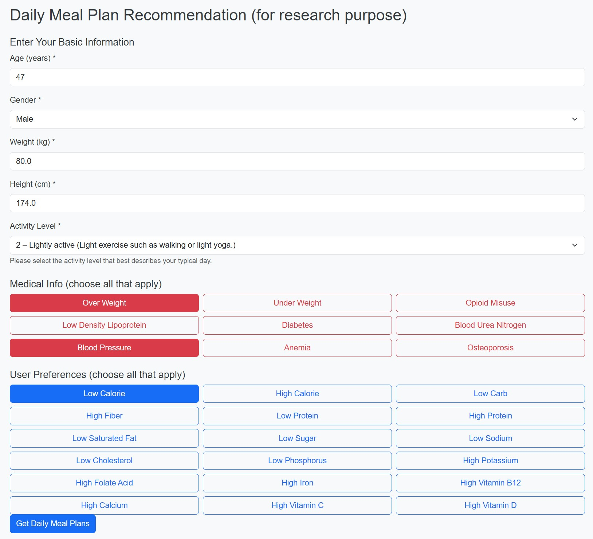
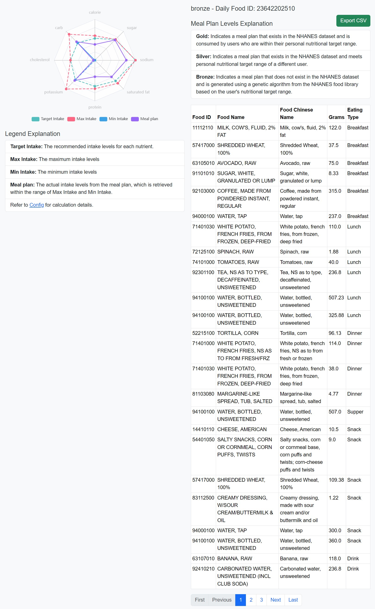

# DMP4P - Daily Meal Plan Recommendation for Personal nutrition requirement

[Online example](https://rec.neusoft.edu.cn/)

Get data at https://doi.org/10.6084/m9.figshare.30153778

1. [Data generation guidance](DATA.md)
2. [Installation](INSTALL.md)
3. [Code guidance](CODE.md)

# Usage Note
1. Input user information

2. Calculate nutrition requirement range based on user information. 
3. Search nutrition requirement range in targets table, and get target list
4. Search target list in meal_plan table and get daily_food_id list
5. Search daily_food_id list in food_user table and get food_id, eating type, grams
6. Search food_id in food_code table and get food description.
7. Return meal plans with food item list

- Author: Lei Zhao
- ORCID: 0009-0004-1363-2258
- mailto: zhaolei@neusoft.edu.cn, tyrone197913@hotmail.com

